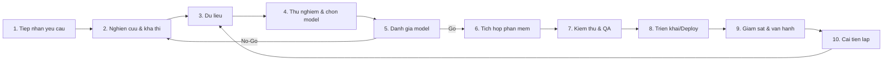

# Quy trình phát triển & triển khai Model AI vào sản phẩm phần mềm

Tài liệu chuẩn hóa quy trình từng bước đưa một mô hình AI vào sản phẩm phần mềm: từ lúc **tiếp nhận yêu cầu**, **nghiên cứu**, **chuẩn bị dữ liệu**, **thử nghiệm và đánh giá model**, đến **tích hợp, kiểm thử, triển khai (deploy)** và **vận hành – cải tiến**.

Tài liệu áp dụng cho cả ba nhóm:

- **[ML] ML truyền thống**: tự huấn luyện model phân loại/hồi quy/dự đoán trên dữ liệu bảng (ví dụ: dự đoán churn, chấm điểm rủi ro, phát hiện gian lận, gợi ý...).
- **[DL] Deep Learning**: mạng nơ-ron sâu cho thị giác máy tính (ảnh/video), NLP, âm thanh/giọng nói, chuỗi thời gian (CNN, RNN/LSTM, Transformer...); thường dùng transfer learning / fine-tune mô hình tiền huấn luyện, cần GPU.
- **[LLM] LLM/GenAI**: dùng API mô hình ngôn ngữ lớn, fine-tune, RAG, hệ thống dựa trên prompt (ví dụ: chatbot, trợ lý, tóm tắt, trích xuất thông tin...).

Ở những bước có khác biệt giữa các nhóm, tài liệu sẽ ghi chú rõ bằng nhãn **[ML]**, **[DL]** và **[LLM]**.

> Lưu ý: LLM về bản chất cũng là deep learning. Ở đây ta tách **[DL]** cho các mạng nơ-ron tự huấn luyện/fine-tune (thị giác, NLP, âm thanh) và **[LLM]** cho mô hình nền/GenAI (chủ yếu dùng qua API, prompt, RAG).

---

## Sơ đồ tổng quan quy trình

Quy trình là một **vòng lặp**: kết quả giám sát ở giai đoạn vận hành sẽ quay lại nuôi dưỡng các giai đoạn dữ liệu/nghiên cứu để cải tiến liên tục.

---

## Cấu trúc tài liệu

| Giai đoạn | File | Nội dung |
|---|---|---|
| 1 | [docs/01-tiep-nhan-yeu-cau.md](docs/01-tiep-nhan-yeu-cau.md) | Tiếp nhận & làm rõ yêu cầu, KPI, ràng buộc |
| 2 | [docs/02-nghien-cuu-kha-thi.md](docs/02-nghien-cuu-kha-thi.md) | Nghiên cứu, baseline, PoC, đánh giá khả thi |
| 3 | [docs/03-du-lieu.md](docs/03-du-lieu.md) | Thu thập, gán nhãn, làm sạch, quản trị dữ liệu |
| 4 | [docs/04-thu-nghiem-lua-chon-model.md](docs/04-thu-nghiem-lua-chon-model.md) | Thí nghiệm, theo dõi experiment, chọn model |
| 5 | [docs/05-danh-gia-model.md](docs/05-danh-gia-model.md) | Đánh giá offline/online, Go/No-Go |
| 6 | [docs/06-tich-hop-phan-mem.md](docs/06-tich-hop-phan-mem.md) | Đóng gói model thành service, API, fallback |
| 7 | [docs/07-kiem-thu-qa.md](docs/07-kiem-thu-qa.md) | Kiểm thử, red-teaming, kiểm thử tải & bảo mật |
| 8 | [docs/08-trien-khai-deploy.md](docs/08-trien-khai-deploy.md) | Chiến lược release, A/B test, rollback |
| 9 | [docs/09-giam-sat-van-hanh.md](docs/09-giam-sat-van-hanh.md) | Monitoring, drift, chi phí, on-call (MLOps/LLMOps) |
| 10 | [docs/10-cai-tien-lap.md](docs/10-cai-tien-lap.md) | Vòng phản hồi, retrain, quản lý nợ kỹ thuật |

### Bộ template/biểu mẫu (`templates/`)

| Template | File | Dùng khi |
|---|---|---|
| Requirement Brief | [templates/01-requirement-brief.md](templates/01-requirement-brief.md) | Khởi tạo yêu cầu mới |
| Model Evaluation Scorecard | [templates/02-model-evaluation-scorecard.md](templates/02-model-evaluation-scorecard.md) | Chấm điểm & quyết định Go/No-Go |
| Model Card | [templates/03-model-card.md](templates/03-model-card.md) | Tài liệu hóa model trước khi deploy |
| Deployment Checklist | [templates/04-deployment-checklist.md](templates/04-deployment-checklist.md) | Trước/trong/sau khi deploy |
| Monitoring Runbook | [templates/05-monitoring-runbook.md](templates/05-monitoring-runbook.md) | Thiết lập giám sát & xử lý sự cố |
| Risk Assessment | [templates/06-risk-assessment.md](templates/06-risk-assessment.md) | Đánh giá rủi ro AI |

---

## Khung chuẩn cho mỗi giai đoạn

Mỗi file giai đoạn được viết theo cùng một khung để dễ áp dụng và kiểm tra:

1. **Mục tiêu** — giai đoạn này nhằm đạt được điều gì.
2. **Đầu vào** — cần có gì để bắt đầu.
3. **Hoạt động chi tiết** — các bước thực hiện, có ghi chú [ML]/[LLM].
4. **Vai trò (RACI)** — ai chịu trách nhiệm, ai tư vấn, ai được thông báo.
5. **Đầu ra** — sản phẩm bàn giao của giai đoạn.
6. **Checklist** — danh sách kiểm tra nhanh.
7. **Tiêu chí qua cổng (Definition of Done / Gate)** — điều kiện để chuyển sang giai đoạn tiếp theo.

> **RACI**: R = Responsible (người làm), A = Accountable (người chịu trách nhiệm cuối cùng), C = Consulted (được tham vấn), I = Informed (được thông báo).

---

## Vai trò tham gia (tổng quan)

| Vai trò | Mô tả |
|---|---|
| Product Owner / BA | Sở hữu yêu cầu nghiệp vụ, KPI, ưu tiên |
| Data Scientist / ML Engineer | Nghiên cứu, train, đánh giá model |
| Data Engineer | Pipeline dữ liệu, hạ tầng dữ liệu |
| ML/Platform Engineer (MLOps) | Đóng gói, deploy, giám sát |
| Software Engineer | Tích hợp model vào sản phẩm |
| QA Engineer | Kiểm thử chất lượng & an toàn |
| Security / Legal / Compliance | Bảo mật, pháp lý, quyền riêng tư |
| SRE / On-call | Vận hành, xử lý sự cố |

---

## Cách dùng tài liệu

- **Bắt đầu một dự án AI mới**: copy [templates/01-requirement-brief.md](templates/01-requirement-brief.md), điền thông tin, rồi đi tuần tự theo các giai đoạn.
- **Trước mỗi cổng chuyển giai đoạn**: dùng phần *Checklist* và *Tiêu chí qua cổng* của giai đoạn để xét duyệt.
- **Trước khi deploy**: hoàn tất [templates/03-model-card.md](templates/03-model-card.md) và [templates/04-deployment-checklist.md](templates/04-deployment-checklist.md).
- **Khi vận hành**: dùng [templates/05-monitoring-runbook.md](templates/05-monitoring-runbook.md) làm cẩm nang xử lý sự cố.

> Đây là tài liệu sống. Hãy điều chỉnh ngưỡng, chỉ số và checklist cho phù hợp bối cảnh sản phẩm và tổ chức của bạn.
