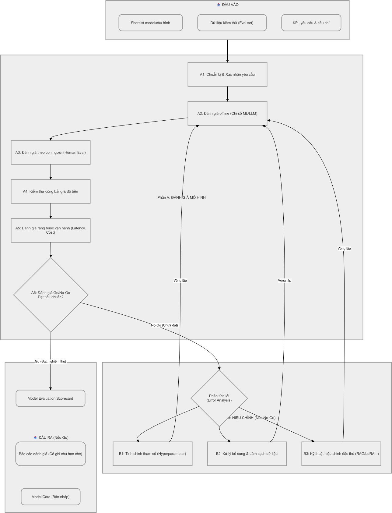

# Giai đoạn 5 — Đánh giá và Hiệu chỉnh (Evaluation & Fine-tuning)

*Ước lượng thời gian thực hiện: 1 - 3 tháng*

## Sơ đồ quy trình

## Mục tiêu

Đánh giá toàn diện ứng viên model trên dữ liệu chưa từng thấy, theo cả **chỉ số kỹ thuật**, **chất lượng theo con người**, **công bằng/an toàn** và **ràng buộc vận hành**, để ra quyết định **Go/No-Go** có căn cứ. Giai đoạn này đóng vai trò như một màng lọc kiểm định chất lượng, nhằm đảm bảo mô hình trí tuệ nhân tạo (AI) hoạt động chính xác, ổn định và đáp ứng đúng các mục tiêu kinh doanh trước khi đưa vào sử dụng thực tế. Quy trình gồm 2 phần chính: **Phần A (Đánh giá)** và **Phần B (Hiệu chỉnh)**, được lặp lại liên tục cho đến khi đạt tiêu chuẩn.

## Đầu vào (Tài liệu cần có)

- Shortlist model/cấu hình (từ giai đoạn 4).
- Dữ liệu kiểm thử mô hình / test set độc lập / eval set (chưa dùng để tinh chỉnh). Tập dữ liệu cần bao quát mọi tình huống thực tế (từ các trường hợp phổ biến đến các tình huống hiếm gặp hoặc khó đoán).
- KPI, yêu cầu thông số và tiêu chí thành công tối thiểu (độ chính xác, thời gian xử lý/phản hồi, tài nguyên phần cứng/ngân sách vận hành).

---

## Phần A: Đánh giá Mô hình

### Mục tiêu Phần A
Đo lường năng lực thực tế của mô hình so với kỳ vọng ban đầu dựa trên 3 tiêu chí cốt lõi:
1. **Độ chính xác**: Khả năng đưa ra kết quả đúng của hệ thống.
2. **Thời gian xử lý**: Tốc độ phản hồi của hệ thống có đủ nhanh cho người dùng không.
3. **Tài nguyên tiêu thụ**: Chi phí vận hành máy chủ/phần cứng cần thiết là bao nhiêu.

### Hoạt động chi tiết (Tổ chức đánh giá toàn diện)

#### Bước A1: Chuẩn bị và Xác nhận yêu cầu
- Thống nhất rõ ràng với các bên liên quan về mức độ chính xác tối thiểu cần đạt, giới hạn thời gian phản hồi (ví dụ: dưới 2 giây/lệnh) và ngân sách vận hành máy chủ.
- Lập kế hoạch đánh giá qua dữ liệu thực tế với các trường hợp và tập dữ liệu từ tích cực nhất tới tiêu cực nhất.

#### Bước A2: Đánh giá offline theo chỉ số kỹ thuật
Đo lường các thông số, xác định các điểm mù của mô hình và các nhóm dữ liệu mà mô hình đang hoạt động kém.
- **[ML] Phân loại (Classification)**: Accuracy, Precision, Recall, **F1-Score**, ROC-AUC, PR-AUC, confusion matrix. Lưu ý chọn chỉ số phù hợp khi dữ liệu mất cân bằng (ưu tiên F1/PR-AUC hơn accuracy).
- **[ML] Hồi quy (Regression)**: MAE, RMSE, MAPE, R².
- **[ML] Xếp hạng/gợi ý**: Precision@k, Recall@k, NDCG, MAP.
- **[ML] Hiệu chỉnh xác suất (calibration)**: Nếu cần xác suất tin cậy.
- **[DL] Theo tác vụ**:
  - Thị giác: Top-1/Top-5 accuracy (phân loại), **mAP**/IoU (phát hiện đối tượng), Dice/IoU (phân vùng).
  - NLP: F1/Exact Match, **BLEU**/**ROUGE**, perplexity.
  - Âm thanh: **WER** (nhận dạng giọng nói).
  - Kiểm tra độ bền với nhiễu/biến đổi đầu vào và tấn công đối nghịch (adversarial).
- **[LLM / NLP]**:
  - **Chỉ số NLP truyền thống**: BLEU, ROUGE, Perplexity.
  - **Chất lượng tác vụ**: Độ chính xác trả lời, độ đúng trích xuất, điểm tương đồng (ví dụ với tham chiếu).
  - **Faithfulness / groundedness** (đặc biệt RAG): Câu trả lời có bám sát nguồn không.
  - **Hallucination rate**: Tỉ lệ bịa đặt.
  - **An toàn**: Tỉ lệ nội dung độc hại/không phù hợp, tuân thủ chính sách.
  - **Tính ổn định**: Độ nhất quán khi lặp lại (do tính ngẫu nhiên).
  - Có thể dùng **LLM-as-a-judge** để chấm tự động (nếu áp dụng Prompt Engineering), nhưng cần hiệu chỉnh với đánh giá của con người.

#### Bước A3: Đánh giá theo con người (Human evaluation)
- Lấy mẫu đại diện, để chuyên gia/người dùng chấm theo tiêu chí (đúng, hữu ích, an toàn, phù hợp).
- Đặc biệt quan trọng với [LLM] và các bài toán khó đo tự động.

#### Bước A4: Kiểm thử công bằng & độ bền (Fairness & robustness)
- So sánh chỉ số giữa các nhóm nhạy cảm để phát hiện thiên lệch.
- Kiểm thử với đầu vào nhiễu/đối nghịch, dữ liệu biên, ngoài phân bố (out-of-distribution).
- [LLM] Thử prompt injection, đầu vào gây hiểu nhầm.

#### Bước A5: Đánh giá ràng buộc vận hành
- Đo **latency** (p50/p95/p99) và thông lượng ở tải dự kiến.
- **Chi phí** mỗi request; [LLM] chi phí token thực tế.
- Kích thước model, yêu cầu tài nguyên (CPU/GPU/RAM).

#### Bước A6: Tổng hợp & Tài liệu hóa Báo cáo đánh giá (Go/No-Go)
- Điền [Model Evaluation Scorecard](../templates/02-model-evaluation-scorecard.md). Tổng hợp các chỉ số đánh giá kỹ thuật, các thông số vận hành và kết quả phân tích lỗi (Error Analysis).
- So sánh với baseline và tiêu chí tối thiểu.
- Ghi nhận danh sách các "điểm mù" và rủi ro còn tồn tại của mô hình.
- Chính thức hóa kết quả đánh giá và đề xuất chấp nhận mô hình (**Go** - nếu đạt ngưỡng) hoặc chuyển sang giai đoạn B (**No-Go / Hiệu chỉnh**).

---

## Phần B: Hiệu chỉnh

Dựa trên kết quả từ giai đoạn A: Đánh giá (đặc biệt là Error Analysis), tiến hành các hành động khắc phục và nâng cấp mô hình.

### Mục tiêu Phần B
Điều chỉnh tham số, dữ liệu và thực hiện huấn luyện/tối ưu lại cho tới khi mô hình đạt được ngưỡng yêu cầu.

### Hoạt động chi tiết

#### Bước B1: Tinh chỉnh tham số (Hyperparameter Tuning)
- Sử dụng Grid Search, Random Search hoặc Bayesian Optimization để tìm ra bộ tham số tối ưu nhất (Learning rate, Batch size, Lớp ẩn...).

#### Bước B2: Xử lý bổ sung dữ liệu
- Dựa vào Error Analysis, bổ sung thêm dữ liệu huấn luyện cho các nhóm đặc trưng (classes/features) bị dự đoán kém.
- Làm sạch lại nhiễu (noise) trong nhãn dữ liệu nếu phát hiện sai sót.

#### Bước B3: Áp dụng các kỹ thuật hiệu chỉnh cho từng bài toán đặc thù
- **Phân loại (Classification)**: Cân bằng dữ liệu (xử lý lệch class bằng focal loss/SMOTE), tinh chỉnh ngưỡng cắt (Threshold) để cân bằng giữa báo động giả và bỏ lọt, hiệu chỉnh xác suất (Probability Calibration).
- **LLM**: Bắt đầu từ việc Tối ưu câu lệnh (Prompt Tuning) và hệ thống tìm kiếm (RAG) trước. Nếu buộc phải huấn luyện thì dùng PEFT/LoRA.
- **NLP (Truyền thống)**: Bổ sung kỹ thuật tạo thêm dữ liệu văn bản (Data augmentation), cập nhật từ vựng mới chuyên ngành (OOV handling), và tối ưu độ dài chuỗi đầu vào.

---

> **Lưu ý Quan Trọng:** Quy trình giữa **[Đánh giá]** và **[Hiệu chỉnh]** là một vòng lặp liên tục. Sau mỗi lần hiệu chỉnh ở Phần B, mô hình sẽ được đem đi đánh giá lại ở Phần A. Vòng lặp này chỉ dừng lại khi hệ thống vượt qua toàn bộ các tiêu chuẩn nghiệm thu đã đề ra ở Bước A1.

---

## Vai trò (RACI)

| Hoạt động             | Data Scientist | QA  | PO/BA | Security/Legal |
| --------------------- | -------------- | --- | ----- | -------------- |
| Đánh giá offline      | A/R            | C   | I     | I              |
| Human evaluation      | R              | C   | A     | I              |
| Fairness & robustness | A/R            | C   | C     | C              |
| Đo latency/chi phí    | R              | C   | C     | I              |
| Quyết định Go/No-Go   | R              | C   | A     | C              |
| Hiệu chỉnh mô hình    | A/R            | C   | I     | I              |

## Đầu ra

- **Model Evaluation Scorecard** đã điền.
- Báo cáo đánh giá: chỉ số, kết quả human eval, fairness/robustness, latency/chi phí và phân tích lỗi (Error Analysis).
- Quyết định Go/No-Go có ghi lý do.
- (Nếu Go) **Model Card** bản nháp (xem [template](../templates/03-model-card.md)).

## Checklist

- [ ] Đánh giá trên test/eval set độc lập, không bị rò rỉ và bao quát mọi tình huống.
- [ ] Dùng chỉ số phù hợp bài toán (không chỉ accuracy khi mất cân bằng).
- [ ] [LLM] Đo faithfulness/hallucination/an toàn, có human eval.
- [ ] Đã kiểm thử công bằng giữa các nhóm và độ bền với đầu vào bất thường.
- [ ] Đã đo latency (p95/p99) và chi phí ở tải dự kiến.
- [ ] Các "điểm mù" và rủi ro được phân tích (Error Analysis).
- [ ] Đã thực hiện hiệu chỉnh (tham số, dữ liệu, kỹ thuật) dựa trên phân tích lỗi nếu chưa đạt tiêu chuẩn.
- [ ] Scorecard hoàn tất, so với baseline & tiêu chí tối thiểu.
- [ ] Hạn chế đã biết được ghi lại.

## Tiêu chí qua cổng (Gate)

- Model **đạt hoặc vượt** tiêu chí thành công tối thiểu và baseline (chính xác, tốc độ, tài nguyên).
- Thỏa ràng buộc latency/chi phí/an toàn, kiểm thử công bằng.
- Có quyết định **Go** kèm Model Card nháp để tiến hành tích hợp; nếu **No-Go**, tiếp tục vòng lặp hiệu chỉnh hoặc quay lại giai đoạn trước.
